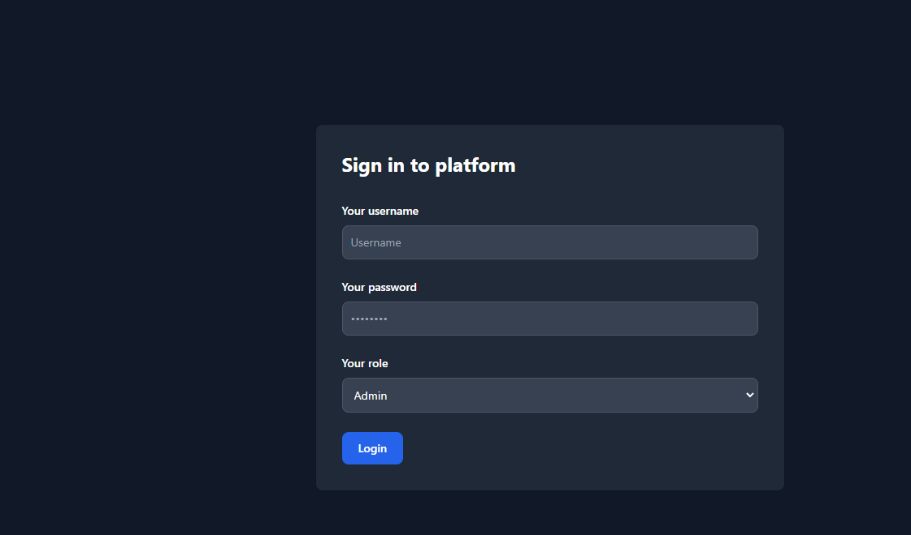

```shell
# Install laravel
composer install
cp .env.example .env
php artisan key:generate

# Build react app
cd react-app
npm install
npm run build
```



```apacheconf
# XAMPP Apache Virtual Hosts
# For Linux just replace C:/xampp/htdocs with /var/www/html
<VirtualHost *:9884>
    ServerName example.com
    DocumentRoot "C:/xampp/htdocs/laravel-react-js/react-app/build"
    
    <Directory "C:/xampp/htdocs/laravel-react-js/react-app/build">
        Options Indexes FollowSymLinks MultiViews
        AllowOverride All
        Order allow,deny
        Allow from all
        RewriteEngine On
        RewriteBase /
        RewriteCond %{REQUEST_FILENAME} !-f
        RewriteCond %{REQUEST_FILENAME} !-d
        RewriteRule ^(.*)$ /index.html [L,QSA]
    </Directory>
    
    Alias /backend "C:/xampp/htdocs/laravel-react-js/public"
    <Directory "C:/xampp/htdocs/laravel-react-js">
        Options Indexes FollowSymLinks MultiViews
        AllowOverride All
        Order allow,deny
        Allow from all
    </Directory>
</VirtualHost>

```

# Note
- Database is provided
- Password check are compared with Laravel Hash or plaintext because I don't know the hashed password of the `users` table.
- Username are check against `nick_name` and `email` because `nick_name` is mostly null.
- `LeaveRequestsModel` use where clause `user_outlet_id = user.id` because `users` table and `leave_requests` table are not related by any foreign key.
